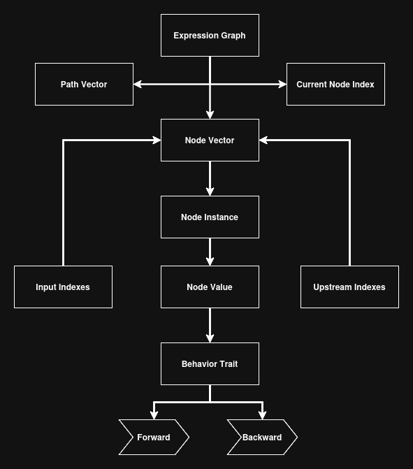
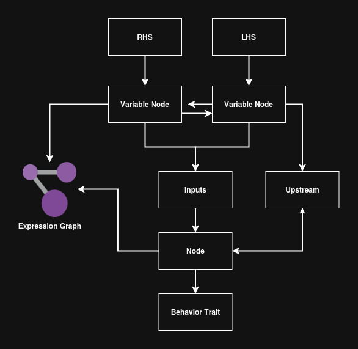
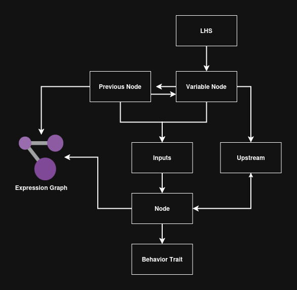

# Expression Graph

* Directed a cyclic graph implementation to perform automatic differentiation for minimizing/maximizing uni/multi variate functions
* Expression graphs contains a vector of `nodes`. A `Node` stores indexes of other nodes to reference inputs and upstream values. 
* For each `node` there is a behavior trait that is stored with it to handle how the forward and backward pass behaves for a given node.
* Each node stores a `Value` which refers to a `Tensor`. Calling the `forward` method of the behavior trait will populate the output of the tensor, calling the `backward` of the behavior trait will populate the gradient of the tensor value. 

### Expression Graph Design 

## Attributes
| Attribute    | Type         | Description                                                                                             |
| ------------ | ------------ | ------------------------------------------------------------------------------------------------------- |
| `nodes`      | `Node<T>`    | Vector of generic nodes that store downstream inputs and upstream values.                               |
| `path`       | `Vec<usize>` | Stores the vector of indices that were traversed in the forward pass.                                   |
| `variables`  | `Vec<usize>` | Stores indexes of nodes in the graph that are variables, variables are values that have no prior inputs |
| `operations` | `Vec<usize>` | Stores indexes of nodes in the graph that are operations, operations have inputs with a computed output |

## Binary Node Formation

* Binary nodes accept 2 input values and assume that a given node will have 2 raw values to perform an operation on.
* The 2 input values provided will create nodes in the expression graph for lineage purposes. Raw input values have a default behavior trait with no inputs associated. 
* After the variable nodes are created, a new node with the operation behavior trait is applied, then the 2 prior variable nodes become input indexes of the operation node.

## Unary Node Formation

* Unary nodes accept 1 input value and assume that an operation is being done on the previous output of a prior node. 
* A variable node is created for the value provided by the user. The input is interpreted is the `lhs` because the right hand side is the output of the previous operation.
* The output of the previous operation and the `rhs` value are then the inputs to the operation node. Then the behavior trait is applied to the inputs. 

## Forward Pass

* The forward pass of the expression graph goes through all the nodes that were added to the graph as operations and inputs were supplied by the user.
* For each iteration on a node, the forward pass method is called and then the index of the node that was computed will get added to a `path` vector. 
* This `path` vector allows for storing the order of operations that were supplied to the graph. This allows for later reference in the backward pass 
## Backward Pass

* The backward pass relies on the `path` vector that's stored in the forward operation. The backward pass cannot be computed if the `path` vector is empty
* The backward pass reverses the `path` vector and then uses the paths to traverse the indices of the nodes of the graph and call the backward method. 