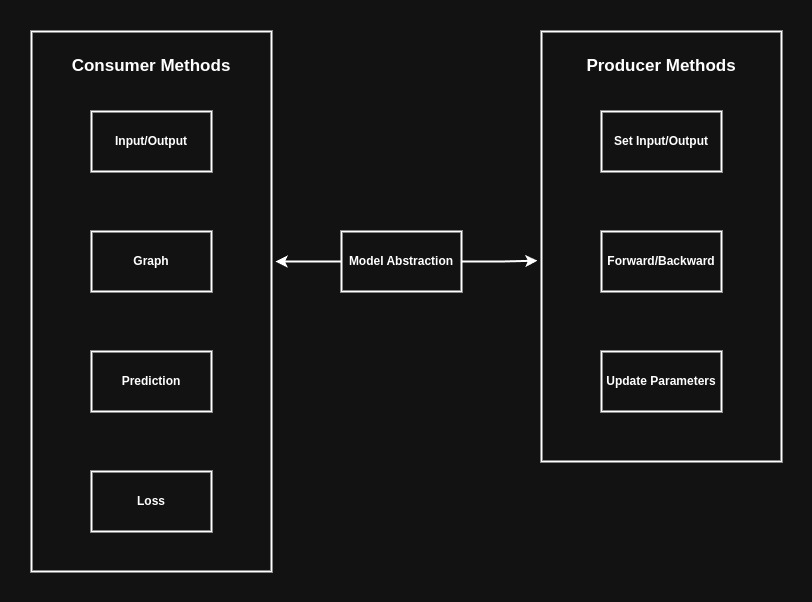
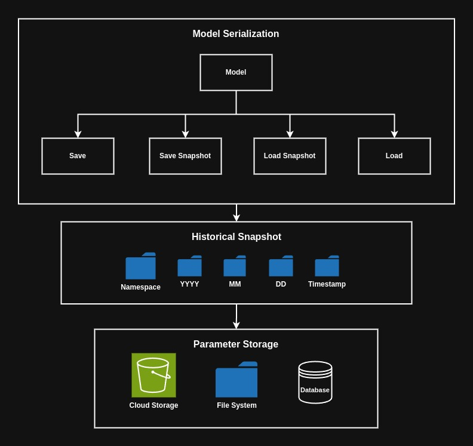
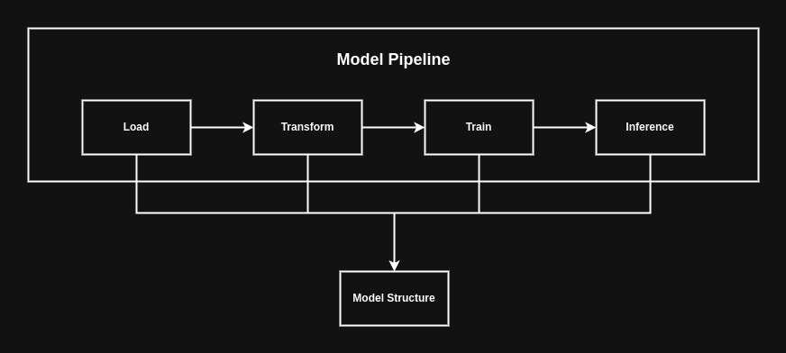

# Model Abstraction Design

* Models are any type of machine learning algorithm consolidated to inherit the model trait which contains common methods/behaviors for all types of models. 
* Model trait contains consumer methods which allow the user to view attributes/data associated with model, producer methods give mutable access to the structures that inherit the traits.

# Model Serialization

* Models that have been instantiated & trained in memory can have their results/attributes serialized for later user.
* Models currently serialize only to files (json), serialization trait will extend to support multiple data storage formats in the future.

## Sample Functions
| Function Name                 | Function Definition                                                                                                                                                    |
| ----------------------------- | ---------------------------------------------------------------------------------------------------------------------------------------------------------------------- |
| **Bowl Function**             | $f(x) = x_1 * x_2^2$                                                                                                                                                   |
| **Bowl Function**             | $f(x) = x_1^2 + x_2^2$                                                                                                                                                 |
| **Narrow Bowl Function**      | $f(x) = sin(x_1) + cos(x_2)$                                                                                                                                           |
| **Rosenbock Banana Function** | $f(x) = (a - x_1)^2 + b(x_2 - x_1^2)^2$                                                                                                                                |
| **Gini Impurity**             | $G = 1 - \sum_{k=1}^{K} p_k^2$                                                                                                                                         |
| **Information Gain**          | $H = -\sum_{k=1}^{K} p_k \log_2(p_k)$                                                                                                                                  |
| **Mean Squared Error**        | $\text{MSE}(\mathbf{w}, b) = \frac{1}{m} \sum_{i=1}^{m} \left( \mathbf{w}^\top \mathbf{x}^{(i)} + b - y^{(i)} \right)^2$                                               |
| **Binary Cross Entropy**      | $\text{BCE}(\mathbf{w}, b) = -\frac{1}{m} \sum_{i=1}^{m} \left[ y^{(i)} \log\left( \hat{y}^{(i)} \right) + (1 - y^{(i)}) \log\left( 1 - \hat{y}^{(i)} \right) \right]$ |
| **Categorical Cross Entropy** | $\text{CCE}(\mathbf{W}, \mathbf{b}) = -\frac{1}{m} \sum_{i=1}^{m} \sum_{k=1}^{K} y_k^{(i)} \log\left( \hat{y}_k^{(i)} \right)$                                         |

## First Order Regression Models
| Model Name      | Description                                                        |
| --------------- | ------------------------------------------------------------------ |
| **Linear**      | Standard linear regression using gradient descent                  |
| **Lasso**       | Linear regression with lambda and learning rate for regularization |
| **Elastic Net** | Regression with combination of lasso and ridge regression          |
| **Ridge**       | Regression with L2 regularization                                  |
| **Logistic**    | Classification using regression with non linear activation         |

# Model Pipeline

* Models created using the `Model` trait will leverage shared behavior for orchestrating and training models in a consistent way. 
* The model pipeline is a shared trait (interface) that all user defined models will inherit from and implement each model's custom implementation of the shared trait. 
* Models will need to implement the 4 common methods of the shared trait, `load` for loading data, `transform` for encoding data, `train` & `inference` for training and handling predictions from the model. 

## Model Pipeline Trait
| Trait Method | Description                                                                                                                                                                    |
| ------------ | ------------------------------------------------------------------------------------------------------------------------------------------------------------------------------ |
| `load`       | Meant for loading data from external sources. Transformation & encoding of data does not apply, data loading can happen from whatever source fetched via programmable access.  |
| `transform`  | Uses the data from the `load` step and applies required data encoding/transformations for model to accept numerically encoded data.                                            |
| `train`      | Method used for handling training iterations for a model (or multiple). Training method is only used for monitoring convergence, predictions should not happen in this phase.  |
| `inference`  | Uses the parameters/values generated from the `train` step to make predictions/classifications.                                                                                |
