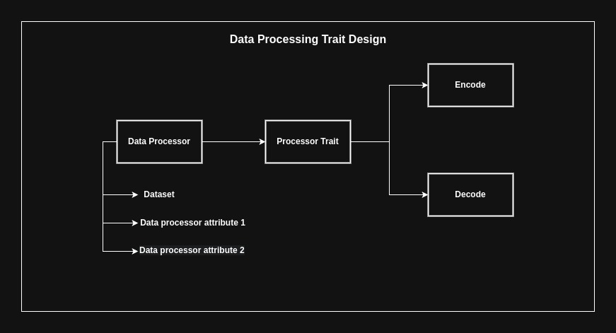

# Data Preprocessing 

* Library component for encoding/decoding data to numerical format for machine learning models to interpret
* Use encoders/decoders to scale & normalize data with larger ranges, use pre-processors to scale inputs for ML models. 
* Data processors will take in dataset (2D Array) as dataset parameter, then use shared behavior for all processors, "encode" & "decode". 
* All types of data processors inherit and extend the same trait that has shared methods to "encode" & "decode" a dataset. 

## Supported Data Processors 
| Name                 | Description                                                                                                                                      |
| -------------------- | ------------------------------------------------------------------------------------------------------------------------------------------------ |
| **One Hot Encoding** | Generates a column for each class/category for multi class classification.                                                                       |
| **Min Max Scalar**   | Shrinks feature values between a range of choices.                                                                                               |
| **Standard Scalar**  | Assumes that a variable is normally distributed, then scales it down so that the standard deviation is 1, and the distribution is centered at 0. |

# Sample Datasets

## Classification
| Dataset                     | Description                            | Classes | Source                                                                                                     |
| --------------------------- | -------------------------------------- | ------- | ---------------------------------------------------------------------------------------------------------- |
| **Iris**                    | Classify species of iris flower        | 3       | [Scikit-learn](https://scikit-learn.org/stable/modules/generated/sklearn.datasets.load_iris.html)          |
| **Wine**                    | Classify wine quality                  | 3       | [Scikit-learn](https://scikit-learn.org/stable/modules/generated/sklearn.datasets.load_wine.html)          |
| **Titanic**                 | Predict survival of passengers         | 2       | [Kaggle](https://www.kaggle.com/c/titanic)                                                                 |
| **Breast Cancer Wisconsin** | Classify tumors as benign or malignant | 2       | [Scikit-learn](https://scikit-learn.org/stable/modules/generated/sklearn.datasets.load_breast_cancer.html) |
| **MNIST**                   | Classify handwritten digits (images)   | 10      | [MNIST](http://yann.lecun.com/exdb/mnist/)                                                                 |
| **Fashion-MNIST**           | Classify clothing items (images)       | 10      | [Kaggle](https://www.kaggle.com/zalando-research/fashionmnist)                                             |
| **Adult Income (Census)**   | Predict income bracket (<=50K or >50K) | 2       | [UCI](https://archive.ics.uci.edu/ml/datasets/adult)                                                       |

## Regression
| Dataset                           | Description                                                  | Size         | Source                                                                                                                       |
| --------------------------------- | ------------------------------------------------------------ | ------------ | ---------------------------------------------------------------------------------------------------------------------------- |
| **Boston Housing** _(Deprecated)_ | Predict house prices based on features like rooms, age, etc. | ~500 rows    | [UCI](https://archive.ics.uci.edu/ml/datasets/housing) _(Note: Deprecated due to ethical concerns. Use California instead.)_ |
| **California Housing**            | Predict median house prices by block                         | ~20,000 rows | [Scikit-learn](https://scikit-learn.org/stable/modules/generated/sklearn.datasets.fetch_california_housing.html)             |
| **Diabetes Dataset**              | Predict diabetes progression                                 | ~400 rows    | [Scikit-learn](https://scikit-learn.org/stable/modules/generated/sklearn.datasets.load_diabetes.html)                        |
| **Bike Sharing**                  | Predict daily/hourly bike rentals                            | ~17,000 rows | [UCI](https://archive.ics.uci.edu/ml/datasets/Bike+Sharing+Dataset)                                                          |
| **Energy Efficiency**             | Predict heating/cooling loads                                | 768 rows     | [UCI](https://archive.ics.uci.edu/ml/datasets/Energy+efficiency)                                                             |
| **Airbnb Pricing (NYC)**          | Predict Airbnb listing prices in NYC                         | ~50,000 rows | [Kaggle](https://www.kaggle.com/dgomonov/new-york-city-airbnb-open-data)                                                     |
